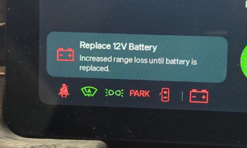

# Replacing the 12V Low Voltage battery

## Applies

  * 2022-2026 Rivian R1T / Rivian R1S

## Diagnosis

  * "Replace 12V Battery" on driver display

## Cause

  * One or more (depending on build date) of the 12V batteries are failing.

## Parts

> Early R1 vehicles (Built 3/23 and before) require two batteries. Later builds
> use a capacitor on the passenger-side which does not need replaced.

  * **OEM:** DCS-18UNC
  * **Third Party:** [OHMMU BT19](https://www.ohmmu.com/product-page/12v-lithium-battery-for-r1t-r1s)
  * **Universal Third Party:** Any 12v, 18Ah (BT19BL-BS group) internal top thread battery + [Reusable Post Relocator](https://soonishev.com/products/battery-post-relocator)

## Tools

  * Plastic clip remover (optional)

## Procedure

  # Open the Frunk, remove the plastic cover at the top of the space by lifting each edge to unsnap it.
  # Locate the batteries at the center of the space
  # Remove the ground nut
