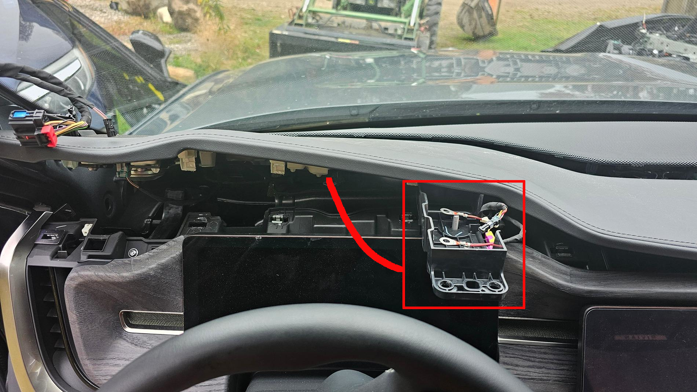
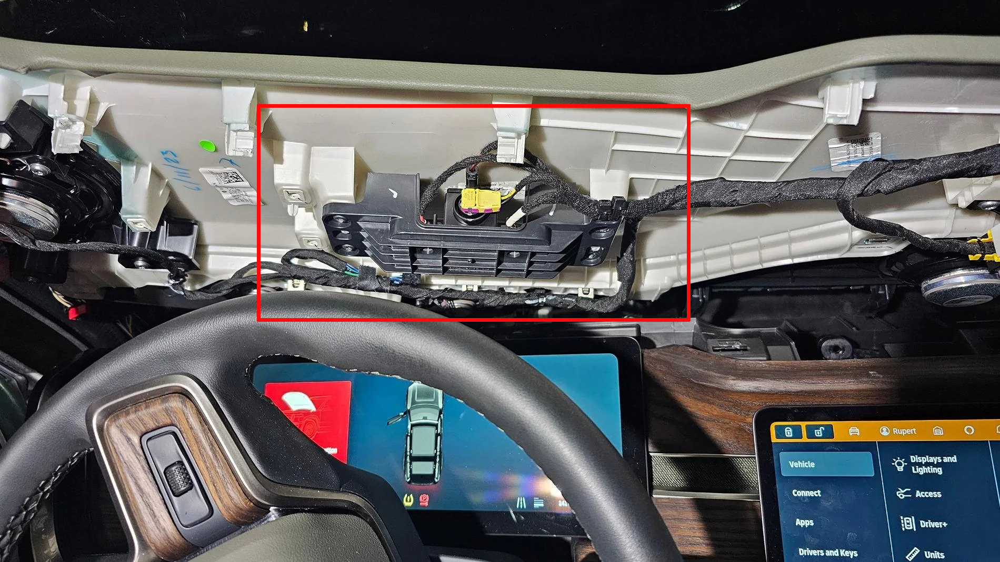

# Replacing the 12V Pyrofuse / Actuator

## Applies

  * 2022-2026 Rivian R1T / Rivian R1S

## Diagnosis

  * TODO
  * Unresponsive vehicle refusing to unlock? See [12V emergency power](emergency-jump.md)

## Cause

  * Blown central 12v Pyrofuse

## Parts

  * [Pyrofuse PSS-3 0080-P1-100017](https://www.xenonplanet.com/actuatorpss-3-pss-3-0080-p1-100017-pyrofuse-for-bmw.html)
    * Other Part Numbers: B2302641744, B2203931056
    * Multiple variants. PSS-3 has an added port on top of the actuator.

## Tools

  * TODO
  * [Plastic clip remover (optional)](https://amzn.to/3L8OWAW)

## Location

## Procedure

  * Under the dash, drivers side
  * see https://www.rivianforums.com/forum/threads/pyro-fuse-location.20924/
  * TODO
