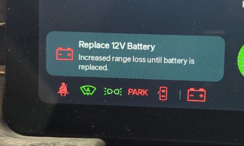

# Replacing the 12V Low Voltage battery

**Difficulty:** 2/5

## Applies

  * 2022-2026 Rivian R1T / Rivian R1S

## Diagnosis

  * "Replace 12V Battery" on driver display
  * Unresponsive vehicle refusing to unlock? See [12V emergency power](emergency-jump.md)

## Cause

  * One or more (depending on build date) of the 12V batteries are failing.

## Parts

> Early R1 vehicles (Built 3/23 and before) require two batteries. Later builds
> use a capacitor on the passenger-side, and a single battery.

* Replacement Battery
  * **Drop-in Third Party:** [OHMMU BT19](https://www.ohmmu.com/product-page/12v-lithium-battery-for-r1t-r1s)
  * **Universal / local Third Party:**
    * [12v, Deep Cycle, High Rate](https://www.batteriesplus.com/productdetails/slahr12=20c_fr)
    * [Reusable Post Relocator](https://soonishev.com/products/battery-post-relocator)
    * [Extended M5 bolt](https://amzn.to/4p4BCfF)
    * [10mm spacer, 5mm ID, 10mm OD](https://amzn.to/3LVKuWo)
  * **OEM:** DCS-18UNC

> Note: If you choose to replace the Lead Acid, 12V AGM battery with a LifePo4 battery, take note that charging a LifePo4 battery in freezing conditions **WILL** damage it.  Only use **heated** LifePo4 batteries such as the Ohmmu.

## Tools

  * [Mechanic gloves](https://amzn.to/3LwpO7d)
  * [Electrical tape](https://amzn.to/4oIQMqM)
  * [10mm socket, 13mm socket, and wrench](https://amzn.to/47crE5V) (insulated handle nice to have, but not required)
  * [Plastic clip remover (optional)](https://amzn.to/3L8OWAW)

## Context

### Dual Battery (Early R1, 3/23 and before)

  1. DCDC Converter Primary
  2. Power Distribution Primary
  3. DCDC Converter Secondary
  4. Power Distribution Secondary
  5. Electric Power Assisted Steering Primary
  6. Electric Power Assisted Steering Secondary

#### Observations

  * Appears that most low voltage vehicle power "passes through" this area.
  * 13A from terminal 3 to terminal 4 while HVAC running and vehicle idle

### Single Battery (Later R1)

> TODO

## Procedure

### Validate Number of 12V Batteries

> TODO photo

  1. Open the front trunk, remove the plastic cover at the top of the space by lifting each edge to unsnap it.
  2. Locate the batteries at the center of the space (just behind the frunk compartment wall)
  3. If in question, determine if you have a single or dual battery design by examining the passenger side.
     1. If the passenger side terminal is black, you have an older build with two batteries. Follow **Passenger Side Battery** and **Drivers Side Battery** below.
     2. if the passenger side terminal is red, you have a later build with a non-replaceable capacitor on the passenger side. Jump to **Drivers Side Battery** below.

### Passenger Side Battery (Dual Battery)

> TODO photos
> TODO steps

### Drivers Side Battery

> TODO photos
> TODO steps

  1. On the battery on the driver side, remove the black terminal's ground nut. 
  2. Remove the positive nut, being careful to not contact any other metal surfaces, wrap the connector in a thin layer of electrical tape.
  3. Remove the battery
  .
  .
