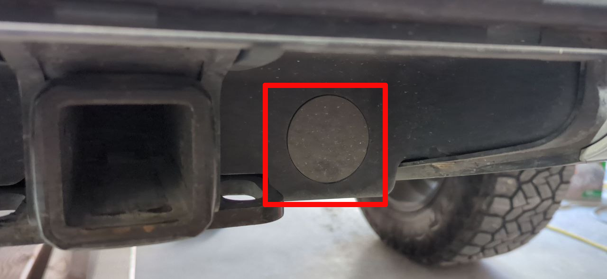
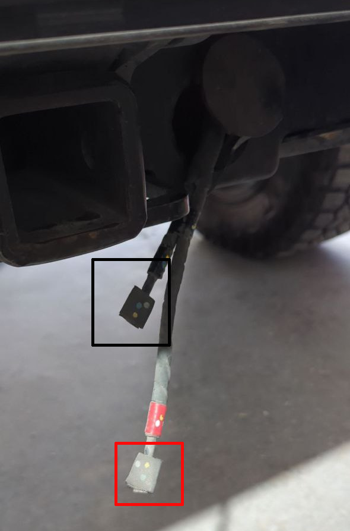

# Emergency power for dead 12V battery

**Difficulty:** 1/5

## Applies

  * 2022-2026 Rivian R1T / Rivian R1S

## Diagnosis

  * Vehicle non-responsive, will not unlock or wake up.
  * Screens dark, won't power on.
  * Pressing brake pedal while sitting in vehicle doesn't wake it.

## Cause

  * One or more (depending on build date) of the 12V batteries are dead.

## Parts

  * 12V power source (Jump pack, car battery, etc)

## Tools

  * [Mechanic gloves](https://amzn.to/3LwpO7d)
  * [Electrical tape](https://amzn.to/4oIQMqM)
  * [Screwdriver](https://amzn.to/3LbPPZp)
  * Power Source
    * [12v jump pack](https://amzn.to/3Lvqb1P)

## Procedure

  
  1. Remove the hitch cover from the back of the vehicle and locate the round plastic plate on the passenger side.
  2. Gently insert a screwdriver to pop out the plate, and locate the two wires
  
  3. Remove any tape from the ends of the wires, attach your power source.
  4. Match red to positive, black to negative.
  5. Turn jump pack on (manual override, constant power, etc.)
  6. Give vehicle a few minutes to power up.  Unlock / open.

> At this point, it is recommended to replace your 12V batteries.

## See Also

[12V Replacement](12v-replacement.md)
